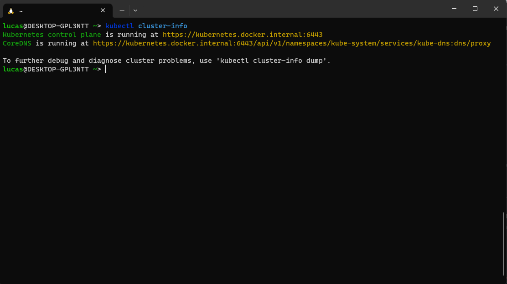
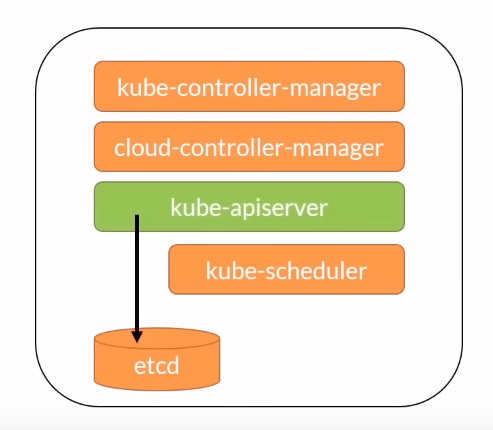

# Orquetração de containers 

## Conceitos de Kubernetes a.k.a K8s
Kubernetes é um projeto criado pelo Google tendo o lançamento de sua versão 1.0 em julho de 2015. É a terceira geração de escalonadores de containers criado pelo Google (projetos anterios são Borg e Omega).

O projeto Kubernetes foi doado à Cloud Native Computing Foundation (www.cncf.io).

Atualmente, K8s é a ferramenta líder em orquestração de containers e foi desenvolvido como uma coleção de componentes voltados para deploy, manutenção e escalabilidade de workloads.

Uma grande vantagem do Kubernetes é que é *vendor neutral*, isto é, não está atrelado a nenhuma empresa e portanto roda em todos as plataformas de cloud.

Além disso, há uma grande comunidade e ecossistema em torno da ferramenta.

## O que Kubernetes pode fazer?
Algumas das tarefas que a ferramenta pode realizar são: descoberta de serviços e balancemanto de carga, orquetração de armazenamento, pode fazer rollouts e rollbacks automaticamente, monitora a saúde dos containers, pode administrar configurações e segredos.

Uma coisa muito interessante é que a mesma API utilizada em uma estrutura *on-premise* é utilizada em uma estrutura na cloud.

## O que Kubernetes não pode fazer?
Não é função do Kubernetes fazer o deploy nem o build das suas aplicações. Não fornece serviço em níveis de aplicação como caches, databases etc.

## Arquitetura Kubernetes 
A seguinte imagem foi tirada da documentação.


Essencialmente, temos um container rodando em um *pod*, um *pod* roda em um *node* e todos os *nodes* formam o cluster.

## Rodando K8s localmente
É possível testar a instalação local do Kubernetes com o seguinte comando:

```kubectl cluster-info```

Se a instalação estiver correta, a seguinte mensagem é exibida:



## K8s API 

A API de server do Kubernetes é um serviço rodando no node *master*. Ela expõe uma API REST que é o único ponto de comunicação com os clusters de Kubernetes. Assim como no Docker, declaramos em um arquivo .YML o estado desejado do nosso sistema e mandamos essas informações para o cluster por meio da API REST.

Para ler mais sobre API REST: https://www.redhat.com/pt-br/topics/api/what-is-a-rest-api

Outras aplicações como Dashboards de monitoriamento também se comunicam com a API para obter informações. 




## Kubernetes CLI

kubectl é a CLI do Kubernetes. A CLI se comunica com os clusters por meio da API. 

As configurações para a CLI são guardadas em **${HOME}/.kube/config**

## Kubernetes context

Um *context* é um grupo de parâmetro de acessos a um cluster de K8s. Geralmente contem um cluster de Kubernetes, um usuário e um namespace.

O *context* atual é o cluster em que o Kubernetes executará os serviços de orquestração. 

Podemos instalar um novo context por meio do minikube usando o seguinte comando:
```
curl -LO https://storage.googleapis.com/minikube/releases/latest/minikube-linux-amd64
sudo install minikube-linux-amd64 /usr/local/bin/minikube
```


Alguns comandos importantes para contexts:

- ```kubectl config current-context``` - Retorna o contexto atual 
- ```kubectl config get-contexts``` - Lista todos os contextos 
- ```kubectl config use-context [contextName]``` - Define o contexto como padrão
- ```kubectl config delete-context [contextName]``` - Deleta o contexto do arquivo de configuração

Existem uma série de ferramentas open-source que facilitam o fluxo de trabalho em K8s. Uma delas é **Kubectx** que permite trocar de contexto rapidamente com o comando:

```kubectx [contextName]```.

Para instalar esse comando vamos utilizar o gerenciador de plugins do Kubernetes: Krew. 

Instalando Krew no bash:
```
(
  set -x; cd "$(mktemp -d)" &&
  OS="$(uname | tr '[:upper:]' '[:lower:]')" &&
  ARCH="$(uname -m | sed -e 's/x86_64/amd64/' -e 's/\(arm\)\(64\)\?.*/\1\2/' -e 's/aarch64$/arm64/')" &&
  KREW="krew-${OS}_${ARCH}" &&
  curl -fsSLO "https://github.com/kubernetes-sigs/krew/releases/latest/download/${KREW}.tar.gz" &&
  tar zxvf "${KREW}.tar.gz" &&
  ./"${KREW}" install krew
)
```

Após a instalação vamos adicoinar ao path:

```export PATH="${KREW_ROOT:-$HOME/.krew}/bin:$PATH"```

Com o Krew instalado podemos instalar o kubectx:

```kubectl krew install ctx```.

## Criando recursos de forma imperativa vs. declarativa
Existem duas formas de criar um recurso do K8s: o modo declarativo e o modo imperativo. 

No método imperativo, se utiliza o comando ```kubectl``` e uma séria de opções do recursos. 

No método declarativo, se define os recursos no arquivo YAML. É muito bom pois é possível de ser replicado e repoduzido.

Vamos a um examplo da criação de um recurso com o módo imperativo:

```
kubectl run mynginx --image=nginx --port=80
kubectl create deploy mynginx --image=nginx --port=80 --replicas=3
kubectl create service nodeport myservice --tagertPort=8080
kubectl delete pod nginx
kubectl delete deployment mynginx
```

Um exemplo com o mode declarativo no arquivo .YML:

```
apiVersion: v1
kind: Pod
metadata:
  name: myapp-pod
  labels:
    app: myapp
    type: front-end
spec:
  containers:
    - name: nginx-container
    - image: nginx
```

## Namespaces 
Namspaces permitem que vários recursos sejam agrupados, ex. prod, stg, dev. 

O namespace padrão do Kubernetes é o **default**.

Além disso, o Kubernetes permitem que recursos de um ambiente possam acessar recursos de outros ambientes. 

Uma coisa útil é que ao deletar um namespace automaticamente todos os recursos dentro desse namespace também serão deletados.

Vamos criar um namespace a partir de um .YML:

```
apiVersion: v1
kind: Namespace 
metadata:
  name: prod
```

Agora ao criar um recurso podemos utilizar esse namespace:

```
apiVersion: v1
kind: Pod 
metadata: 
  name: myapp-pod
  namespace: prod
spec: 
  containers: 
  - name: nginx container
    image: nginx
```

Os principais comandos são:

- ```kubectl get namespace``` - Lista todos os namespaces
- ```kubectl get ns``` - Atalho para o comando acima
- ```kubectl config set-context --current --namespace=[namespaceName]``` - Configurar o contexto atual para usar determinado namespace
- ```kubectl create ns [namespaceName]``` - Cria um namespace
- ```kubectl delete ns [namespaceName] ``` - Deleta um namespaec
- ```kubectl get pods --all-namespaces``` - Lista todos os pods em um namespace.

## Master Node - Control Plane
Um nó é uma máquina físca ou virtual e um conjunto de nós formam um cluster.

Os serviços relativos ao Kubernetes rodam dentro do Control Plane, que também são chamados de *master components*

Não é recomendado que containers sejam executados no Control Plane.

## Componente: kube-apiserver
Como vimos no começo, esse componente expõe uma API REST. Também tem a função de salvar o estado dos serviços no **etcd**. Dessa forma, todos os clientes interagem com essa api e não diretamente com o banco de dados.

## Componente: etcd
O componente master **etcd** é um banco de dados chave-valor. A API do kubernetes é o único componente que se comunica com **etcd**. Age como o banco de dados em cluster que armazena o estado. 

Não é um database que deve ser utilizado pelas aplicações. 

É o que dizemos que ser a *single source of truth* do Kubernetes.

## Componente: kube-control-manager
Esse componente é o "*controlador de rank mais alto*". Sua função é controlar os outros controladores do kubernetes. Esses serviços são:
- Node controller
- Replication controller
- Endpoint controller
- Token controller

## Componente: cloud-control-manager
Sua função é interagir com os controladores dos provedores de cloud. 
- Checa se Nodes foram deletados na Cloud depois que param de responder
- Criar rotas de tráfego de internet
- Criar, atualizar ou deletar balanceadores de carga
- Interagir com o serviços de armazenamento: criar, acoplar e montar volumes. 

## Componente: kube-scheduler
Esse componente monitora Pods recentemente criados que não possuem nenhum Node atrelado e seleciona um Node para que o Pod seja executado. Esse processo é chamado de escalonamento. 

Vários fatores são levados em conta ao selecionar esse Node:
- Requisitos inviduais e coletivos de recursos
- Limitações de hardware, software e permissões

## Comenponente: addons
Além disso, é possível instalar uma série de addons no Crontol Plane como:
- DNS
- Dashboards
- Logging de clusters
- Monitoramento de containers

Isso conclui os nossos componentes do *master node*.

## Worker Nodes
Nodes são máquinas virtuais ou físicas. Um grupo de Nodes formam um cluster. Quando um Worker Node é adicionado ao cluster, alguns serviços básicos do Kubernetes são instalados nele:

- container-runtime
- kubelet
- kube-proxy

Esses serviços são essenciais para execução do Node e são administrados pelos serviços do Control Plane. 

## Componente: kubelet 
Os pods passam por algo que chamado  *lifecycle*, por exemplo transitar de *Pending* para *Running*. Esse *lifecyle* é administrado pelo kubelet. Também garante que os containers descritos nas especificações do Pod estejam rodando e estejam *healthy*. 

## Componente: kube-proxy
É um proxy de rede que administra as regras de rede em cada node. Todo tráfego de rede passa pelo proxy. 


