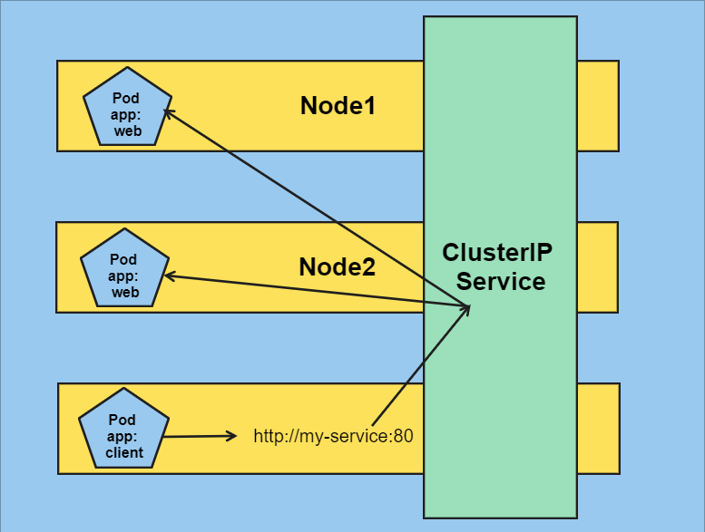
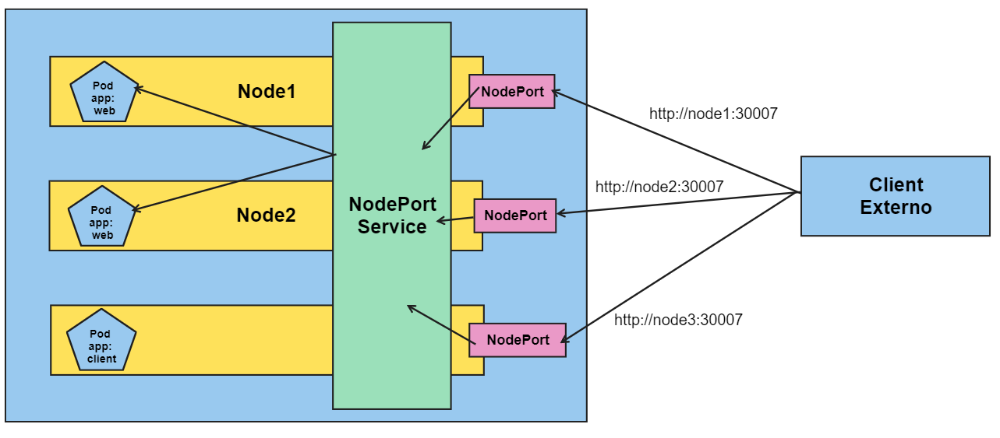
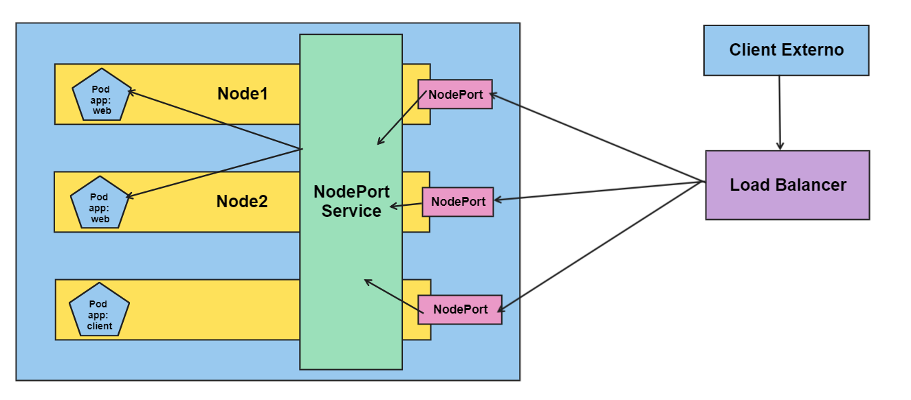

# Serviços no Kubernetes

Existem três tipos de diferentes de serviços do Kubernetes:

- ClusterIP
- NodePort
- LoadBalancer

Saber qual tipo de serviço a ser configurado é essencial para estabelecer conexões de rede.

## ClusterIP

O arquivo YAML abaixo define um serviço do tipo **ClusterIP** que direciona o tráfego na porta **80** para a porta **8080** para quaisquer pods que tenham o *label* **app** setado para **web**:

```
apiVersion: v1
kind: Service
metadata:
  name: my-service
spec:
  type: ClusterIP
  selector:
    app: web
  ports:
    - protocol: TCP
      port: 80
      targetPort: 8080
```

O **ClusterIP** expõe pods a uma rede de tráfego interna. Por exemplo, pode ser preciso expor um database a um outro pod por meio de um **ClusterIP** porque clients externos não devem ter acesso direto ao database.

**ClusterIP** expõe a menor área possível e dever ser utilizado para pods que se comunicam apenas com outros pods dentro do mesmo cluster. 

A imagem abaixo exemplifica como os pods se comunicam por meio do **ClusterIP**:




## NodePort

O arquivo YAML abaixo define um **NodePort** que redireciona o tráfego na porta 33007 de cada node para a porta 8080 em quaisquer um dos pods que tenham o label **app: web**:

```
apiVersion: v1
kind: Service
metadata:
  name: my-service
spec:
  type: NodePort
  selector:
    app: web
  ports:
    - protocol: TCP
      port: 80
      targetPort: 8080
      nodePort: 30007
```

**NodePort** expõe os pods internamente da mesma maneira que o **ClusterIP**. Em adição, também permite que clients externos acessem os pods por meio das portas de rede abertas no nodes do Kubernetes. Essas portas tipicamente estão no intervalo 30000 - 32768.

Esse tipo de serviço é útil para expor os pods a tráfego externo no qual os clients tem acesso de rede ao Kubernetes. Por exemplo, se os seu nodes tem os hostnames *node1* e *node2*, o **NodePort** permite que o client acesse **http://node1:30007** e **http://node2:300007**. Não importa qual node o client externo se conecta, já que o Kubernetes redireciona todo o tráfego que entra na porta 30007 para *qualquer* node que tenha os pods apropriados.

Na prática, não são muito utilizados em produção. Portas não usuais estão sujeitas a regras de firewall restritas e é difícil entender com qual serviço você está se comunicando usando uma URL do tipo **http://node1:30007**. Entretando, esse tipo de serviço é ótimo para realizar testes, já que não exige nenhuma outra configuração de infraestrutura adicional. 

O diagrama abaixo mostra como clients externos se comunicam com os pods pelas portas expostas no YAML:




## LoadBalancer

O YAML abaixo define um **LoadBalancer** que direciona o tráfego da porta 80 em um **LoadBalancer** público para a porta 8080 de quaisquer um dos pods com o labal **app: web**:

```
apiVersion: v1
kind: Service
metadata:
  name: my-service
spec:
  type: LoadBalancer
  selector:
    app: web
  ports:
    - protocol: TCP
      port: 80
      targetPort: 8080
```

O serviço **LoadBalancer** expõe os pods internamente da mesma maniera que o **NodePort**. Em adição, esse tipo de serviço cria uma estrutura externa de rede que direciona o tráfego para os pods no cluster. Nos provedores de cloud, o load balancer externo e tipicamente um serviço já existente. Por exemplo, no EKS é possível criar um Elastic Load Balancer (ELB) para expor os pods a rede externa.

Esse tipo de serviço é a melhor escolha quando os pods precisam ser expostos por meio de uma URL previsível ou quando algum controle adicional das conexões externas é requerido. Ao usar um load balancer externo, o serviço **LoadBalancer** permite que os administrados configurem coisas como escalamento, firewalls, routing e outras configurações de redes.

O diagrama abaixo mostra como os clients externos se comunicam com os pods por meio de um load balancer criado pelo serviço **LoadBalancer**:





